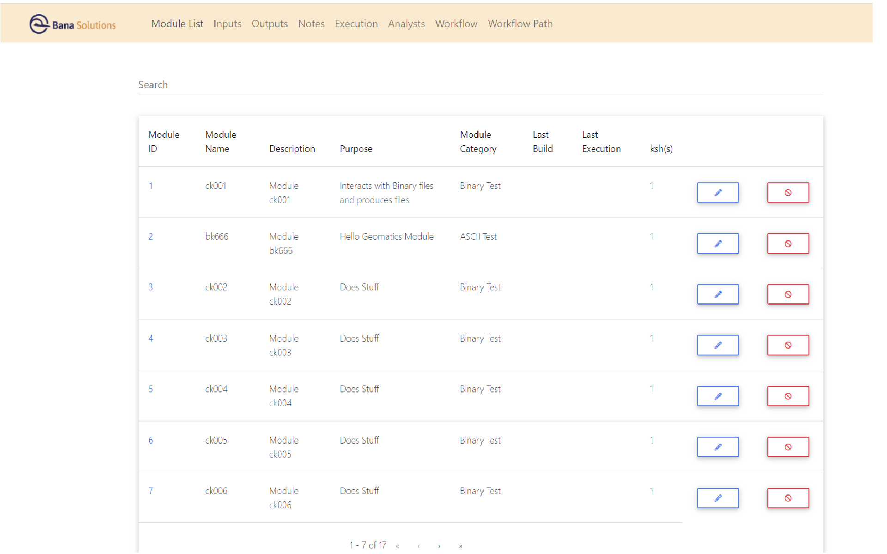

# Angular front end with node js server to pull from mysql database


### Prerequisites
To run this code you should install the angular cli:

``` 
npm install -g @angular/cli
 ```
*If running the code in gov cloud create an ssh tunnel for ports 8080 and 4200*

If using putty navigate to Connection-> SSH-> Tunnels. For source port give 4200 and Destination give localhost:4200 then click add. Repeat for port 8080. If using command line use commands: 
``` 
ssh -L 8080:localhost:8080 user@HostIP
ssh -L 4200:localhost:4200 user@HostIP
``` 
### How to run
*The way I run this code is by first moving the code to the dev.gms.bana.com ec2 instance. (Either by Filezilla or using git clone). You can run everything there or just the backend.*

Run this code from the current folder using the following commands:

``` 
cd backend
npm install
npm start
``` 
Then open a new terminal window navigate to the sql-angular-nodejs folder
```
cd frontend
npm install
ng serve
```


### Features
- In this gui you can view the tables in marydb

- You can search the table columns for a specific item

- You can scroll through multiple pages of the selected table 

- The workflow table's column analyst id links to the analyst table

- The input and output tables have the column module id which links to the module table

- The user can add, delete, or edit a entry in the module table

- Clicking the Module id in the Module table brings up a list of input and output files


### Screenshot 


